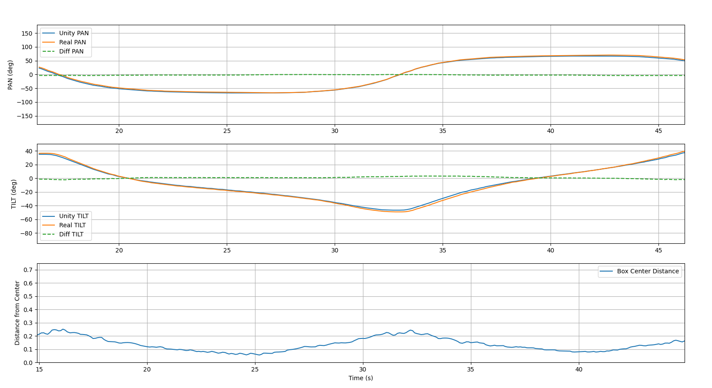

### `Hibou Simulation`

 

Simulate vision and audio (not implemented yet) in Unity.

# Vision simulation

Vision simulation aims to simulate a PTZ camera to test different camera movement tracking algorithms.

**Project architecture:**

- **Unity** (/vision)
    - `PTZ_base`: Simulate real camera hardware
    - `Drone`: Simulate real drone mouve

- **Python** (/vision/Python)
    - `main.py`: Receive drone position in real-time through and return camera command.

Internally `main.py` use the same python code as in [Hibou-Server](https://github.com/PST4Hibou/Hibou-Server), it could
also move the real camera as long as the virtual one.

### Run vision simulation

1. First clone the repository and open the `vision` folder in Unity.
2. Check project default settings (see: Vision simulation configuration)
3. In `/vision/Python` run the main.py with `uv run main.py`
4. Start the Unity project

### Supported Hardware

To make this project useful, it must fit real camera hardware for reliable results and tracking.

Hardware configuration is in: `/vision/Assets/PtzHardware`

A new camera can be easily added by creating a new as long as you know technical details.

Today following PTZ cameras are supported:

- Hikevision `DS_2DY9250IAX_A`

PTZ orientation over time. Both the real and simulated cameras are controlled using velocity commands in a given
direction, rather than absolute angle positions.

### Vision Simulation Configuration

#### Unity

##### PTZ_Base

###### PTZ Base (Script)

| Parameter   | Comment                                                |
|-------------|--------------------------------------------------------|
| Hardware    | Select the camera you want to simulate. Movement only. |
| Virtual FPS | Set the FPS of the virtual camera                      |

###### Rotation Logger (Script)

| Parameter | Comment                                                                                |
|-----------|----------------------------------------------------------------------------------------|
| Enable    | Enable or disable the rotation logger. Send the camera rotation to the Python backend. |

If `PTZ_ENABLED = True` then it will show cameras rotation over the time in a matplotlib window

##### Drone

###### Drone (Script)

| Parameter | Comment                                    |
|-----------|--------------------------------------------|
| Seed      | Random seed, for movement reproductibility |
| Min Speed | Minimum speed movement                     |
| Max Speed | Maximum speed movement                     |

#### Python

Settings can be changed in the `.env` file.

| Parameter    | Comment                                        |
|--------------|------------------------------------------------|
| PTZ_ENABLED  | Enables real PTZ control to reproduce movement |
| PTZ_USERNAME | Username used to control the PTZ camera.       |
| PTZ_PASSWORD | Password for the PTZ camera user.              |
| PTZ_HOST     | IPv4 address of the PTZ camera                 |

